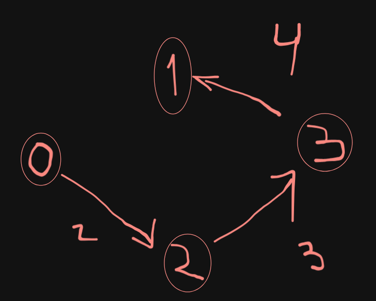

# Como executar o exercício 02?

- É possível executá-lo diretamente e inserir as informações acerca de cada aresta manualmente, contudo, aconselhamos utiliza piping (pipe) para automatizar a entrada dos inputs (informações acerca do grafo)
- Para tal, dois arquivos txt que representam as entradas requisitadas pelo programa estão sendo fornecidos - um para o algoritmo de **Dijkstra** e outro para o de **Floyd-Warshall**.

```
# primeiro compile os arquivos .c
# e depois, para executá-los com piping de entrada:

./ex02_dijkstra < input_floyd.txt
./ex02_floyd_warshall < input_floyd.txt
```

- Os exemplos do input fazem referência a este grafo:

