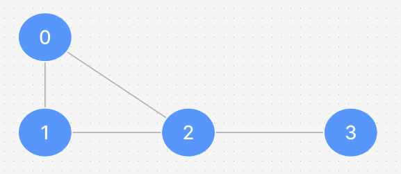

# Exercício da Aula 06 (Clique Maximal)

```bash
# compilar o programa
make

# limpar o workspace
make clean

# verificar o grafo de entrada
cat exemplo.dat

# executar o programa
./main
```

- As implementações principais estão no arquivo `Graph.cpp` e `Graph.h`

- O programa utiliza um grafo de entrada que pode ser alterado usando o arquivo exemplo.dat

- Para alterar o nó inicial do método que encontra a clique maximal é preciso alterar diretamente o arquivo `main.cpp`

- O grafo de entrada utilizado pelo grupos foi este:


