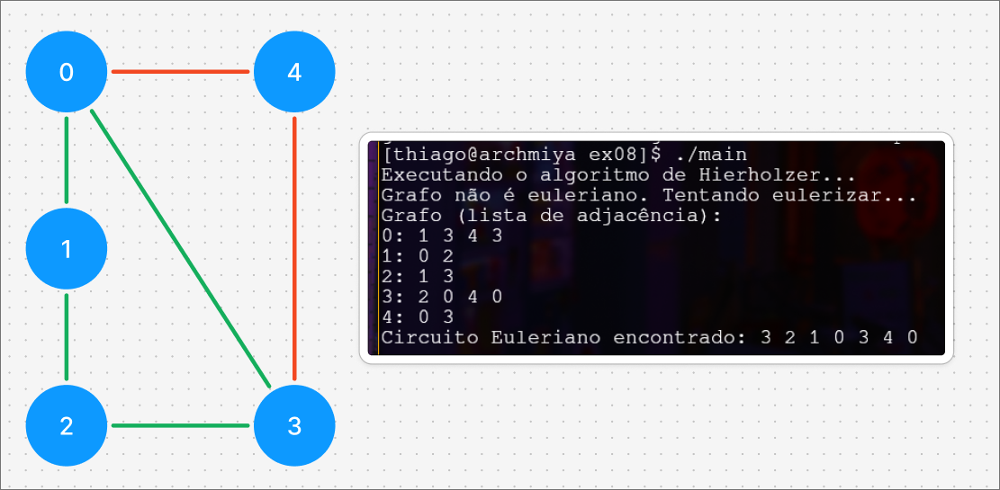

# Solução para a Atividade da Aula 08

- Para compilar o código rode `make`
- Para limpar os executáveis `make clean`
- Para inserir um grafo via arquivo `.dat`, altere o arquivo `exemplo.dat`:
```
0 1 1   // vertice 0, vertice 1, peso 1
1 2 1
2 3 1
3 0 1
0 4 1
4 3 1
```
- Como o peso é irrelevante, neste caso, adicione o peso = 1 para todas as arestas
- Em `main.cpp` altere a variável `qtNodes` para refletir a quantidade de nós do grafo que deseja utilizar para rodar o programa (**muito importante**).
- Grafo utilizado de exemplo:
